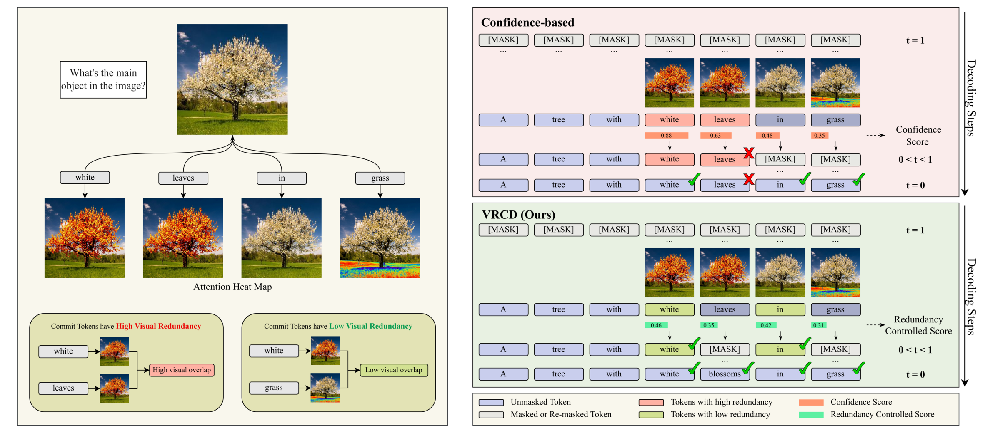
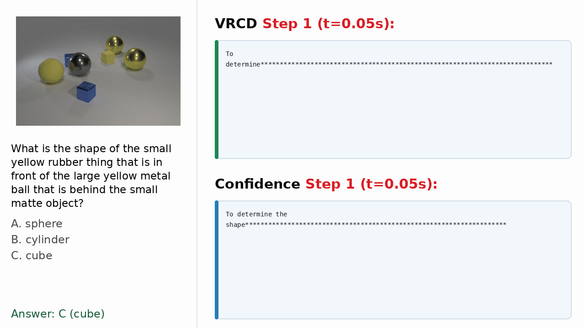

# Visual-Redundancy-Controlled Parallel Decoding for Diffusion-Based Multimodal Large Language Models

<p align="center">
  <a href="https://arxiv.org/abs/2605.25820"></a>
  <a href="https://github.com/infiniteYuanyl/VRCD"></a>
</p>

<p align="center">
  
</p>

<p align="center">
  
</p>

## Introduction

We propose **Visual-Redundancy-Controlled Parallel Decoding (VRCD)**, a **lightweight**, **plug-and-play** decoding method for diffusion-based MLLMs. It controls **visual redundancy** among candidate tokens to improve parallel decoding quality and adds almost no inference overhead. The demo above compares both methods on the same example with the same decoding schedule, predicting 4 tokens per model forward step.

## Quick Start

```bash
git clone https://github.com/infiniteYuanyl/VRCD.git
cd VRCD

bash scripts/setup_vrcd_env.sh
conda activate vrcd
```

The setup script configures a Python 3.11 environment running on CUDA 12.4 with the required Python packages for inference.

## Run Inference

Demo images are provided under `examples/`. Use `predict.py` to run inference:

```bash
python predict.py \
  --img-path examples/objects.png \
  --len 192 \
  --step-ratio 0.25 \
  --shift 1.0 \
  --alpha 1.5 \
  --window-lambda 2.0 \
  --temperature 0.0
```

Important parameters:

- `--img-path`: input image path.
- `--len`: maximum generated answer length.
- `--step-ratio`: diffusion decoding ratio. With `0.25`, the model predicts 4 tokens per step.
- `--alpha`: visual-redundancy penalty strength.
- `--window-lambda`: scale factor for expanding the candidate window relative to the number of selected tokens.
- `--shift`: shift schedule value. With `1.0`, each diffusion step decodes the same number of tokens.
- `--temperature`: sampling temperature. `0.0` uses deterministic decoding.

## Acknowledgements

This repository is built upon [LaViDa](https://github.com/jacklishufan/LaViDa). We thank the LaViDa authors for releasing their code and models.

## Citation

If you find VRCD useful for your research, please cite:

```bibtex
@article{yuan2026visualredundancycontrolled,
  title={Visual-Redundancy-Controlled Parallel Decoding for Diffusion-Based Multimodal Large Language Models},
  author={Yuan, Yulin and Zhao, Hongshuo and Meng, Xiangming},
  journal={arXiv preprint arXiv:2605.25820},
  year={2026}
}
```

VRCD is implemented on top of LaViDa. If you use this codebase or the underlying LaViDa model, please also cite:

```bibtex
@inproceedings{lilavida,
  title={LaViDa: A Large Diffusion Model for Vision-Language Understanding},
  author={Li, Shufan and Kallidromitis, Konstantinos and Bansal, Hritik and Gokul, Akash and Kato, Yusuke and Kozuka, Kazuki and Kuen, Jason and Lin, Zhe and Chang, Kai-Wei and Grover, Aditya},
  booktitle={The Thirty-ninth Annual Conference on Neural Information Processing Systems},
  year={2025}
}
```
